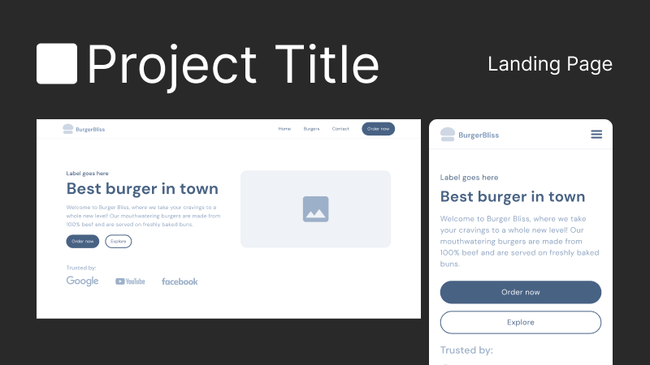
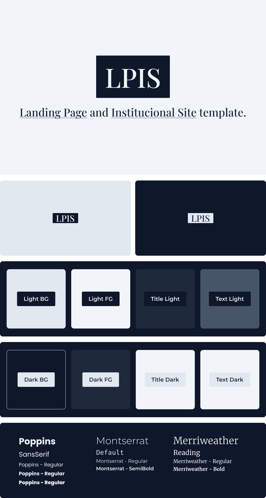

   # [🧬 `LPIS Template`]() <!-- omit in toc --> 

🧬 A template for rapidly developing astounishing landing pages and institucional sites.

*Read in other languages: [English](README.md) or [Português](README.br.md).*

   | [Notion](https://www.notion.so/)    | 
   | ----------------------------------- |

   
   

## `Table Of Contents` <!-- omit in toc -->

- [🏷️ `Features`](#️-features)
- [📜 `Purpose`](#-purpose)
- [👨‍💻 `Technologies And Packages`](#-technologies-and-packages)

### 🏷️ `Features`
- Pre-made generic components with easy styling with no JS;
- Pre-made sections to more easily structure pages only by changing their showing order;
- No JS and JS only loading when in the users initial viewport if needed.

### 📜 `Purpose`
This a literature blog that will use Notion as an intermediate to the making of new posts.

### 👨‍💻 `Technologies And Packages`

 
   
   
   

 

- [Yarn]()

[⬆ Back To Top](#-lpis-template)