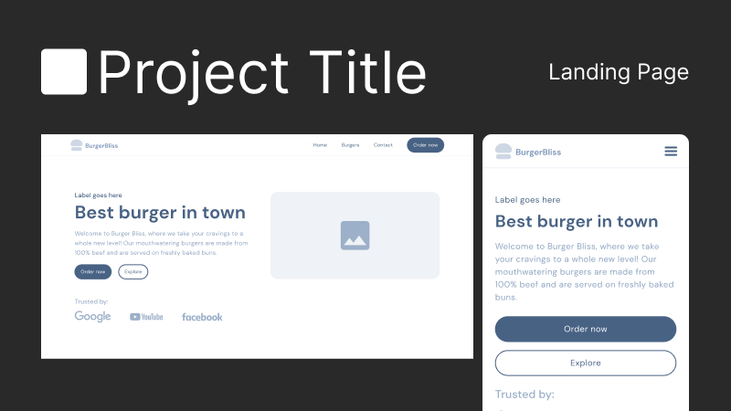

# [LPIS Template]()
A landing page/institucional site template for a fastened development.

*Read in another language: [Português](README.br.md).*

| [Insightful Docs - Notion]()  | 
| ----------------------------- |

---

# Technologies, Techniques And Lessons Learned 
**Yarn**
> Used yarn berry for it's speeed and global offline cache. 

**TailWind**
> Agilely develop pages with it's utility CSS on classes making things faster and lighter.

**Astro**
> Less javascript, island and the possibility to use other librarys and frameworks makes it the most flexible and performance rewarding choice.