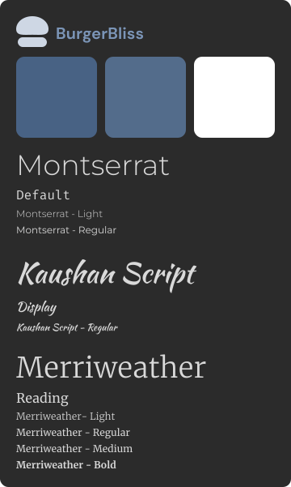

# [LPIS Template]()
A landing page/institucional site template for a fastened development.

*Read in another language: [Português](README.br.md).*

| [Insightful Docs - Notion](google.com)  | 
| --------------------------------------- |

---

# `Visual Identity`

# `Technologies, Techniques And Lessons Learned`
**Yarn**
> Yarn Berry, better, faster and stronger.
- Plug'N Play;
- Workspaces.

**TailWind**
> Agilely develop pages with it's utility CSS on classes making things faster and lighter.

**Astro**
> Less javascript, island and the possibility to use other libraries and frameworks makes it the most flexible and performance rewarding choice.
- Smart Loading;
- SEO Optimized.
