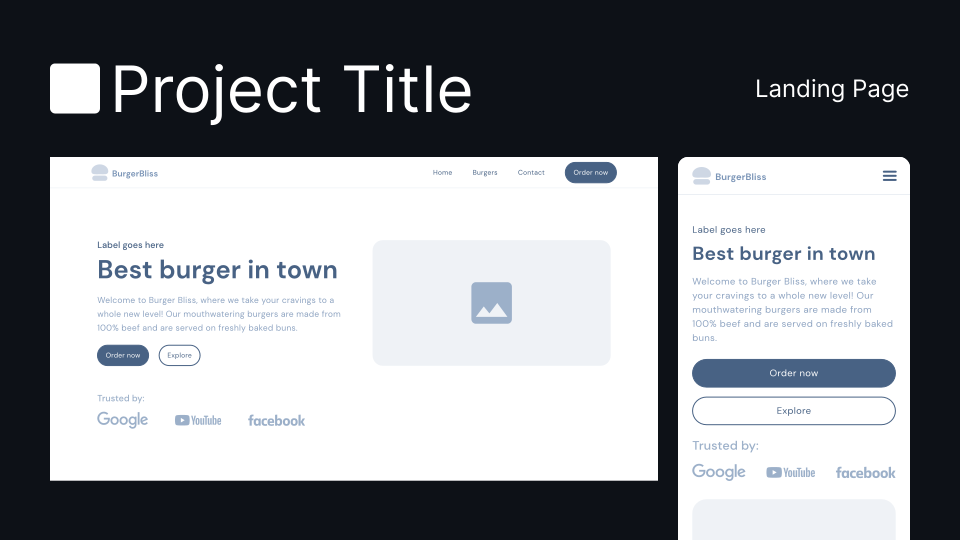
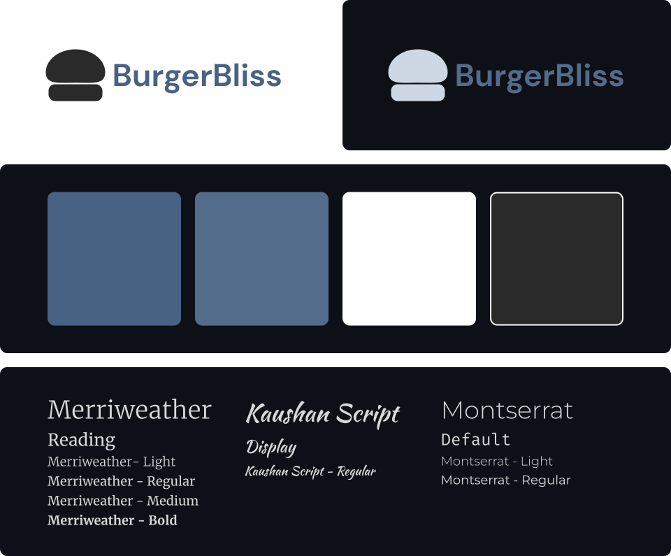

# [LPIS Template]()
A landing page/institucional site template for a fastened development.

*Read in another language: [Português](README.br.md).*

| [Insightful Docs - Notion](google.com)  | 
| --------------------------------------- |

---
**Table Of Contents**
- [🎨 Visual Identity](#-visual-identity)
- [⚙️ Technologies And Techniques](#%EF%B8%8F-technologies-and-techniques)
- [💻 Contributors](#-contributors)
- [📝 License](#-license)

# `🎨 Visual Identity`

# `⚙️ Technologies And Techniques`
**Yarn**
> Yarn Berry, better, faster and stronger.
- Plug'N Play;
- Workspaces.

**TailWind**
> Agilely develop pages with it's utility CSS on classes making things faster and lighter.

**Astro**
> Less javascript, island and the possibility to use other libraries and frameworks makes it the most flexible and performance rewarding choice.
- Smart Loading;
- SEO Optimized.

# `💻 Contributors`

<table>
  <tr>
    <td align="center">
      <a href="https://github.com/ThiagoThalisson">
         
        
            

                <b>Thiago Thalisson</b>
            

        
        
            
        
      </a>
    </td>
  </tr>
</table>

# `📝 License`
This project is under the Apache license. See the [license](LICENSE) file for mode details.

[⬆️ Return To Top](#LPIS-Template)