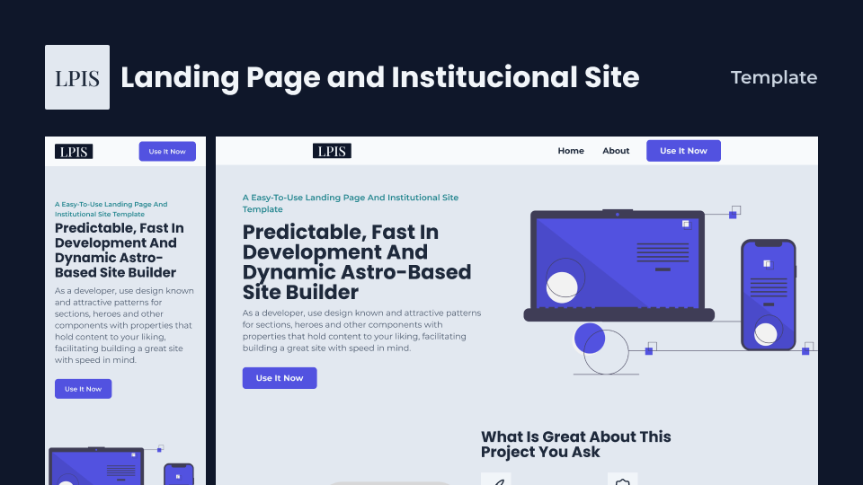

# [🧬 `LPIS Template`](https://lpis-template.vercel.app/) <!-- omit in toc -->

🧬 A template for rapidly developing astounishing landing pages and institucional sites.

<!-- _Read in other languages: [English](README.md) or [Português](README.br.md)._ -->

| [Notion](https://atomicfeast.notion.site/LPIS-Template-EN-US-c22eef0a9fdf4b66bb84105f5b9e25c1?pvs=4) |
| ---------------------------------------------------------------------------------------------------- |

## 📖 `Table Of Contents` <!-- omit in toc -->

- [🏷️ `Features`](#️-features)
- [📜 `Purpose`](#-purpose)
- [👨‍💻 `Technologies And Packages`](#-technologies-and-packages)

### 🏷️ `Features`

- Pre-made heros, sections, social proofs to more easily structure pages only by changing their showing order;
- Styling with variables on TailWind and setting up fonts globally, reset included. Modify some files to quickly change visual identity.
- Variant system using properties that can later be utilized in pages through objects.
- Image optimization made with Astro.

### 📜 `Purpose`

Ease all hurdles that comes with creating a new website everytime and increase substancially developments speed rates when creating a landing page our institucional site.

### 👨‍💻 `Technologies And Packages`

 
   
   
   

 

- [Yarn](https://yarnpkg.com/getting-started)

[⬆ Back To Top](#-lpis-template)
