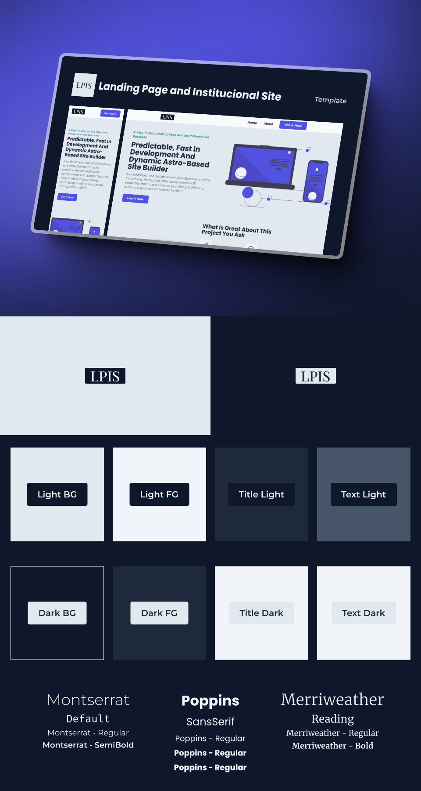

# [🧬 `LPIS Template`](https://lpis-template.vercel.app/)

🧬 A template for rapidly developing astounishing landing pages and institucional sites.

<!-- _Read in other languages: [English](README.md) or [Português](README.br.md)._ -->

| [Notion](https://atomicfeast.notion.site/LPIS-Template-EN-US-c22eef0a9fdf4b66bb84105f5b9e25c1?pvs=4) |
| ---------------------------------------------------------------------------------------------------- |

## 📖 `Table Of Contents` <!-- omit in toc -->

- [🧬 `LPIS Template`](#-lpis-template)
  - [🏷️ `Features`](#️-features)
  - [📜 `Purpose`](#-purpose)
  - [👨‍💻 `Technologies And Packages`](#-technologies-and-packages)
  - [📦 `Project Requirements`](#-project-requirements)

### 🏷️ `Features`

- Pre-made heros, sections, social proofs to more easily structure pages only by changing their showing order;
- Styling with variables on TailWind and setting up fonts globally, reset included. Modify some files to quickly change visual identity.
- Variant system using properties that can later be called for inside pages.
- Image optimization made with Astro.
- Ships with a SEO component to help improve search engine scores.

### 📜 `Purpose`

Ease all hurdles that comes with creating a new website everytime and increase substancially development speed rates when creating a landing page or a institucional site.

### 👨‍💻 `Technologies And Packages`

 
   
   
   
   

### 📦 `Project Requirements`

Install:

- [Node 20.12.0](https://nodejs.org/en/download).
- [Yarn 4.1.1](https://yarnpkg.com/getting-started/install).

After, inside the project, run `yarn` on a terminal to install all packages.

By later running `yarn dev`, you'll start the development environment on `localhost:4321`.
When finishing changes on `dev`, don't forget to run `yarn build` and `yarn preview` to statically generate the site and test it, since not every change on `dev` may match your `build` before committing.

 

[⬆ Back To Top](#-lpis-template-)
